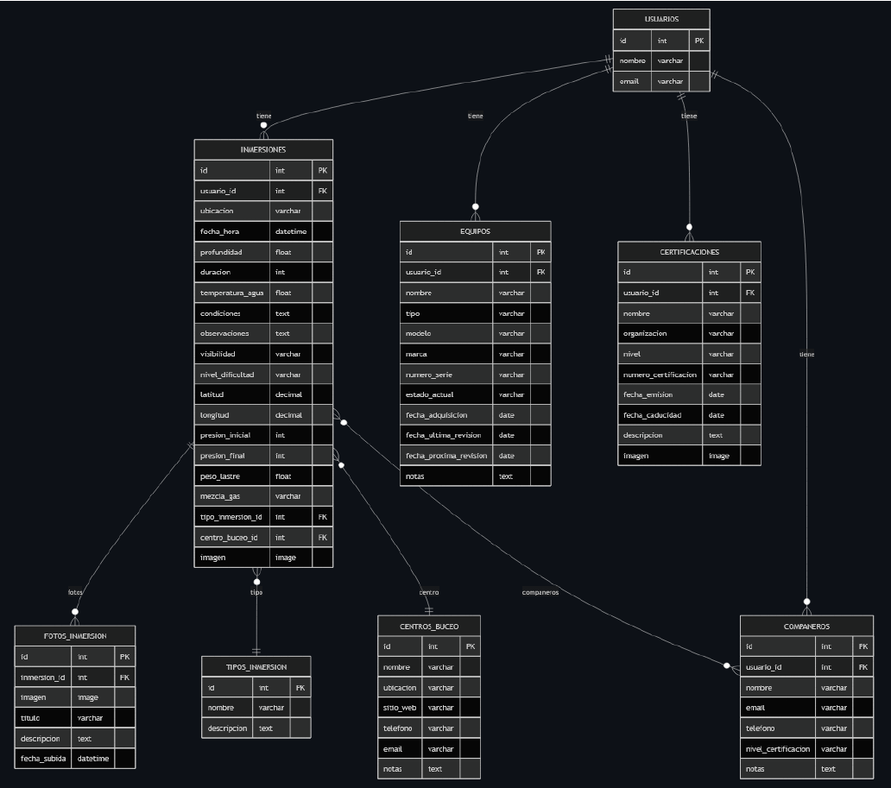

# 🤿 DiveLog App | Enterprise Diving Management Platform

**Plataforma integral SaaS para la gestión de inmersiones, equipamiento y certificaciones de buceo.**
*Desplegada en infraestructura Cloud con arquitectura escalable.*

[🔗 **VER DEMO EN VIVO**](https://divelogapp-production.up.railway.app/)
*(Credenciales Demo más abajo)*

---

## 🚀 Sobre el Proyecto

**DiveLog App** nace para cubrir un hueco en el software de buceo profesional: la falta de herramientas centralizadas que combinen bitácora digital, gestión de ciclo de vida del equipo y seguridad.

A diferencia de las apps de registro simples, esta plataforma está diseñada con una **Arquitectura Híbrida** preparada para escalar, separando la lógica de negocio (Backend API) de la capa de presentación, permitiendo la integración futura con clientes móviles nativos (React Native/Flutter).

### 🌟 Funcionalidades Key (Core Features)

* **📊 Dashboard Analítico:** Visualización de estadísticas en tiempo real (profundidad media, tiempo de fondo, consumo de gas) con animaciones CSS optimizadas.
* **🗺️ Geolocalización GIS:** Integración con **Leaflet.js** para el mapeo exacto de puntos de inmersión.
* **⚙️ Gestión de Activos (Equipos):** Ciclo de vida del hardware, alertas de mantenimiento preventivo y control de revisiones.
* **🔐 Seguridad Enterprise:** Implementación de **OAuth2 (Google)**, Hashing PBKDF2, protección CSRF y sistema de tokens para la API.
* **📱 Diseño Responsive:** UI adaptativa con modo oscuro/claro automático basado en preferencias del sistema.

---

## 🏗️ Arquitectura del Sistema

El sistema sigue una arquitectura monolítica modular desacoplada, diseñada para facilitar la transición a microservicios si fuese necesario.

### Diagrama de Arquitectura
> *El sistema desacopla el cliente web del núcleo lógico mediante una API RESTful, permitiendo múltiples clientes (Web, Mobile).*

*(Ver Página 12 de la Memoria Técnica)*

### Stack Tecnológico

| Capa | Tecnología | Descripción |
| :--- | :--- | :--- |
| **Backend** | **Django 4.2 + DRF** | Lógica de negocio, ORM y exposición de API RESTful. |
| **Database** | **PostgreSQL** | Persistencia relacional robusta con integridad referencial estricta. |
| **Frontend** | **Bootstrap 5 + JS** | Interfaz reactiva con renderizado híbrido (SSR + AJAX). |
| **Maps** | **Leaflet + GIS** | Renderizado de mapas y clusterización de marcadores. |
| **Auth** | **OAuth2 + JWT** | Sistema dual de autenticación (Social + Token). |
| **Infra** | **Railway + Docker** | CI/CD Pipeline y orquestación de contenedores. |

---

## 💾 Diseño de Datos (ERD)

La base de datos PostgreSQL ha sido normalizada para garantizar la integridad de los datos críticos de seguridad (inmersiones y equipos).

*(Esquema relacional mostrando la vinculación entre Usuarios, Equipos, Certificaciones e Inmersiones - Ver Pág 16 Memoria)*

---

## 🔌 API Reference

El backend expone una API completa documentada y navegable.

**Endpoints Principales:**
* `GET /api/inmersiones/` - Filtrado avanzado por profundidad, ubicación y fecha.
* `POST /api/equipos/` - Registro de nuevo hardware con validación de fechas de revisión.
* `GET /api/stats/` - Agregación de datos para el dashboard en tiempo real.

---

## 🔐 Acceso a la Demo

Puedes probar la aplicación en entorno de producción sin necesidad de registro utilizando las credenciales de invitado:

* **URL:** [https://divelogapp-production.up.railway.app/](https://divelogapp-production.up.railway.app/)
* **Usuario:** `demo@divelog.com`
* **Contraseña:** `divelogdemo`
---

## 🛡️ Notas de Seguridad y Privacidad

Este repositorio es un **escaparate técnico (Showcase)**. El código fuente se mantiene en un repositorio privado por razones de propiedad intelectual y seguridad comercial.

Sin embargo, la arquitectura demuestra buenas prácticas de **DevSecOps**:
1.  **Environment Variables:** Gestión estricta de secretos (`SECRET_KEY`, DB Credentials) fuera del código.
2.  **Sanitización:** Uso de Django ORM para prevenir inyecciones SQL.
3.  **HTTPS:** Enforce SSL en producción.

---

### 👤 Autor

**Yago Menéndez**
*Senior Backend Engineer & Cloud Architect*

[LinkedIn](https://www.linkedin.com/in/ymenendez) | [GitHub](https://github.com/ymvs84)
